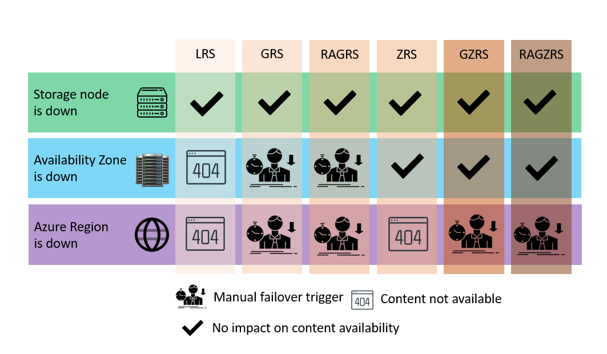

# LINUX

### Creating an empty file in linux

`touch test.txt`

### Checking permissions on the file
`ls -l`

### Changing permissions in linux for the owner of the file

In Linux, you can change file permissions using the chmod command.

* `chmod +rwx` filename to add permissions
* `chmod -rwx` directoryname to remove permissions. 
* `chmod +x` filename to allow executable permissions.
* `chmod -wx` filename to take out write and executable permissions.


Note that “r” is for read, “w” is for write, and “x” is for execute. 

This only changes the permissions for the owner of the file.

### Changing permissions in linux for the for the group owners and others

The command for changing directory permissions for group owners is similar, but add a “g” for group or “o” for others, 'u' will be for 'user/owner':

* `chmod g+w filename`

* `chmod g-wx filename`

* `chmod o+w filename`

* `chmod o-rwx foldername` '-' removes permissions

To change directory permissions for everyone, use “u” for users, “g” for group, “o” for others, and “ugo” or “a” (for all).

* `chmod ugo+rwx foldername` to give read, write, and execute to everyone.

* `chmod a=r foldername` to give only read permission for everyone.


### Changing Linux permissions in numeric code

You may need to know how to change permissions in numeric code in Linux, so to do this you use numbers instead of “r”, “w”, or “x”.
* 0 = No Permission
* 1 = Execute
* 2 = Write
* 4 = Read

Permission numbers are:

* 0 = ---

* 1 = --x

* 2 = -w-

* 3 = -wx

* 4 = r-

* 5 = r-x

* 6 = rw-

* 7 = rwx

For example:

* `chmod 777 foldername` will give read, write, and execute permissions for everyone.

* `chmod 700 foldername` will give read, write, and execute permissions for the user only.

* `chmod 327 foldername` will give write and execute (3) permission for the user, w (2) for the group, and read, write, and execute for the users.

### changing owner in linux

`chown new_owner file_or_directory_path`

`chown -R new_owner directory_path` - change owner for the directory and all the files inside

### Checking the system version

`uname -v` - -v version of the operating system

## What is Bash

Bourne Again SHell
Unix was a text based operating system. Bash is an upgraded version of what was used in Unix.

/bin/bash

#### What is a Shell?

It is a software that basically provides interface to run commands.

There are multiple shells


`cat /etc/shells`   - listing all different shells installed in your os

`ps -p $$`  - shows the processes that we are running (-p $$ specyfing current process)

`history` - history of commands that we have already ran

`!22` - ran the command from history under the number 22

`history -c` - cleaning the history

`ls` - list files and folders

`ls -a` - list all hidden files and directories

Linux treats everything as a file. Even the folder 

`cd` - going to the home directory / cd used to navigate between directories

`pwd` - present working directory

/ - root directory

`cd /` - going to root directory

root directory - separate from the other users directories. It is for super user

. - current directory
.. - parent directory

`ls -l` listing permissions for user, groups and everyone else

blue color is for directories, white for files

`curl <url for something>` - transfering data / saving files


`curl <url> --output <name of the file we want to save the data>` - saving the data to the actual file we specified

`file <file name>` - checking what type of file is this

`mv <file name> <new file name>` moving / transferring file to another file / changing the file. does not duplicate


`cp <file we want to copy> <new file name>` copying the file / duplicating

`rm <file we want to remove>` - removing the file

`mkdir <directory name>` - creating a new directory

`rm -r <directory name>` - removing directory -r means recursive. It will remove wverything inside the folder as well

cd my\ pictures = cd "my pictures"

`touch <file name>` - creating empty file

`nano <file name>` - opens editor on the chosen file

`cat <file name>` - printing the content of the  file to the terminal

`head -2 <name of the file>` - printing first 2 lines of the file to therminal

`tail -2 <name of the file>` - printing last 2 lines of the file to terminal

`nl <name of the file>` - numbers lines in your file

`cat chicken-joke.txt | grep <line or word you are looking for>` - search a file and highligh what it finds

`apt install tree` - to install packages e.g tree package

add `sudo` for super user permission

### tree commands

`tree` - tree structure for files and folders for where you currently are

`sudo apt update -y` - update sources list just in case package is not on the list. -y to agree for the questions 

`mv chicken-joke.txt funny-stuff/funny-jokes/` - moving a file to another directory

`mv ~/funny-stuff/chicken-joke.txt .` - moving a file if you are not in the directory where the file is. '.' stands for current directory

`mv bad-joke.txt ~` or `mv bad-joke.txt ..`  - moving a file to a home directory

## Scripting

Making a script file

`touch provision.sh` - .sh - script files
`nano provision.sh` - open editor to write commands

if you are owner of the file you dont need to use `sudo`

`#!/bin/bash`  - always start to tell which shell we want to use

`# update` - update the sources
`sudo apt update -y`


`# upgrade` - sometimes you dont want upgrade cause its install new packages
`sudo apt upgrade -y`

`# install nginx`
`sudo apt install nginx -y`

`# restart nginx`
`sudo systemctl restart nginx`

`# enable nginx` - make sure when VM is restarted nginx will automatically start with restart
`sudo systemctl enable nginx


`chmod +x provision.sh` - adding execute permission

`./provision.sh `To run a script

Nginx (engine-x) is a popular open-source web server and reverse proxy server. Commonly used in web hosting environments to serve websites and web applications.
  ```bash  
    #!/bin/bash

    # update
    sudo apt update -y

     # upgrade
     sudo apt upgrade -y
     # install nginx
     sudo apt install nginx -y
     # restart nginx
     sudo systemctl restart nginx
     # enable nginx
     sudo systemctl enable nginx
```


systemctl is a command-line tool used to control and manage systemd services in Linux. Systemd is a system and service manager that provides a range of funcionalities including, starting, stopping and monitoring services.

In the given script systemctl is used to interact with Nginx service.

### Environment variables

value stored in memory, it can be accessible by other tools in Linux

`printenv` - printing all environment variables and values e.g USER, PATH, 


`printenv USER` - printing specific variable USER

`MYNAME=krzysztof` - creating variable

`echo $MYNAME`  - printing MYNAME variable to the console

`export MYNAME=krzysztof` - creating ENVIRONMENTAL variable

`unset <name of your variable>` - removes variable

Editing `.bashrc` file to make environmental variables persistent (so they won't dissapear after logging out)

`nano .bashrc` - opening editor with the file

and add at the bottom of the file environmental variable e.g:

`export CATSNAME=Bobby`

`source .bashrc` - reload edited configuration file

After all these steps env variable will be persistent after next time we log in

### IP addressess:

Public IP address (associated VM)
* static - (default Azure) stays the same even when VM is restarted
* dynamic - (default AWS) - changes IP every restart of your VM

### Processes

2 types:

* system processes: `ps aux`
* user processes: `ps`

Process is like a program that loaded to RAM. If your CPU has 1 core basically CPU can run 1 process at the time. Multicores can do more.
OS needs to prioritize processes. Which one most important.

PID - process ID (every process has a process ID)

#### How to start and kill the process

`sleep <number of seconds>` - puts terminal to sleep (puts foreground) for certain amount of time

`sleep 5000 &` - puts terminal to sleep for 5000 sec but in the background

`jobs` - lists processes running in the background

`jobs -l` - list of processes with the process ID

`kill -1 <process ID>` - kills the proecss in the most gentle way (signal 1) - hanging up

`kill <process ID>` - kill the process, terminating (signal 15) - it will kill parent process and also child processes

`kill -9 <process ID>` - the harshest way of killing the process. Brute force stubborn process.  (signal 9) - it will kill the parent process but child processes will turn up zombie processes that might still running and taking up the memories

`ps -ef` - shows parent process ID

`sudo systemctl` - way to control system processes

# Sparta test app:


## Requirements to run Sparta app:

* Linux VM - Ubuntu 18.04 LTS
* web server - nginx
* right version node js - version 12.x works fine (dependency)
* app folder
* in app folder, run 2 commands:
  - npm install
  - node app.js or npm start

## getting folder to VM azure

* git clone

    - create a gitrepo - tech241-sparta-app
    - create a folder "tech241-sparta-app" on your local machine
    - copy app folder to your local reo
    - sync with your remote repo on GitHub
    - SSH into VM & git clone

Command to clone sparta app repo to your VM:

`git clone https://github.com/majeranowski/tech241-sparta-app.git app3`

* scp command
  
    - will need the private key
    - path to folder
    - adminuser@IP address

Command to copy the folder app to your VM:

`scp -i ~/.ssh/tech241-krzysztof-az-key -r ./app adminuser@40.120.57.73:/home/adminuser/tech241-sparta-app`
  
* rsync 

<mark>The difference betwen scp and git clone: Using scp command you have to do it from your OS command line. With git clone you can be already logged in to your VM.</mark>

### deploying app

```bash 
# updating current packages to the latest of your installed version.
sudo apt update -y
# upgrading (will install new packages if necessery)
sudo apt upgrade -y

# get from the website needed version of nodejs
curl -sL https://deb.nodesource.com/setup_12.x | sudo -E bash -

#install nodejs
sudo apt install -y nodejs

#installing pm2 that helps run apps in the background
sudo npm install pm2 -g 

#go to the app folder until you see content
npm install

# get the app going
npm start # or node app.js
```

You need to add inboud security rule for port 3000 to your VM. 

On Azure portal it is in 'Networking' tab and then 'Add inbound port rule'

.png)

### Side Notes:

* after ctrl + z the app won't start again because it will be keep ocuppying the port 3000. Use ctrl+c instead

* 2 services can't use the same port


## running db on the VM

<mark>create new VM for db

Requirements to get the db running for sparta app:

* Linux VM - Ubuntu 18.04 LTS
* update and upgrade
* Install mongo db version 3.2.x (non relational db)
  - download key for the right version
  - source list - specify mongo db version
  - update again
  - install mongo db
* configure mongo db to accept connections from app VM 


```bash 
sudo apt update -y

sudo apt upgrade -y

#to download key for the right version (from mongo db website)
wget -qO - https://www.mongodb.org/static/pgp/server-3.2.asc | sudo apt-key add -

# source list
echo "deb http://repo.mongodb.org/apt/ubuntu xenial/mongodb-org/3.2 multiverse" | sudo tee /etc/apt/sources.list.d/mongodb-org-3.2.list

# update again
sudo apt update -y

# install mongo db
sudo apt-get install -y mongodb-org=3.2.20 mongodb-org-server=3.2.20 mongodb-org-shell=3.2.20 mongodb-org-mongos=3.2.20 mongodb-org-tools=3.2.20

#configuration
sudo nano /etc/mongod.conf # in network interfaces we change bindIP to 0.0.0.0 to accept connections from any machines. It is not a prefered way because we allow everyone to access it but for the purpose of training it is ok.

#start mongod
sudo systemctl start mongod

#enabling mongod so it will always start
sudo systemctl enable mongod

```

127.0.0.1 - IP adress of the local host

* `sudo systemctl status mongod` - checking if mongodb is running

* `sudo nano /etc/mongod.conf` - after running the script it is a good practise to check manually the config file and see if the bindip was changed.


## Connecting app and db: 

Requirements to run Sparta app
* Linux VM - Ubuntu 18.04 LTS
* web server - nginx
* right version node js - version 12.x works fine (dependency)
* get app folder
* <mark>(if we want postpage to work) set DB_HOST env variable
* in app folder, run 2 commands:
  - npm install
  - node app.js or npm start


### ON THE APP VM:

Right before `npm install` step we have to create an enironmental variable that gives us the 'location' of the database we want to get data from.

* Command to create env variable:

`export DB_HOST=mongodb://<IP-ADDRESS>:27017/posts`

```bash
 export DB_HOST=mongodb://20.162.216.138:27017/posts

```

after this step, as previously we can navigate to our app folder and:

`npm install` and `npm start`


### ON THE DB VM:


* you need to add inboud port security rule for port 27017


.png)

If everything ran without errors we can check if our app is connected to the database by entering below link to a web browser:

`http://40.120.57.73:3000/posts` - remember to change the IP address with your app VM public IP.


# Automation Tasks:

You can automate above processes with 2 scripts provided below. They contain the same commands explained previously. Remember about the specific order. DB script should be ran before APP script.

## App VM script:

```bash
#!/bin/bash


# update
sudo apt update -y

# upgrade
sudo apt upgrade -y
# install nginx
sudo apt install nginx -y
# restart nginx
sudo systemctl restart nginx
# enable nginx
sudo systemctl enable nginx
# get from url needed version of node
curl -sL https://deb.nodesource.com/setup_12.x | sudo -E bash -
# install nodejs
sudo apt install -y nodejs
#installing pm2 that helps run apps in the background
sudo npm install pm2 -g
# getting app folder to the VM
git clone https://github.com/majeranowski/tech241-sparta-app.git app3
#getting inside app folder
cd app3/app
#Creating DB_HOST env variable
export DB_HOST=mongodb://20.162.216.138:27017/posts
# installing the app
npm install
# starting the app in the background by using pm2 (node process managers)
pm2 start app.js

```

## db VM script:

```bash
#!/bin/bash

# Update and upgrade the system
sudo apt update -y
sudo apt upgrade -y

#to download key for the right version (from mongo db website)
wget -qO - https://www.mongodb.org/static/pgp/server-3.2.asc | sudo apt-key add -

# source list
echo "deb http://repo.mongodb.org/apt/ubuntu xenial/mongodb-org/3.2 multiverse" | sudo tee /etc/apt/sources.list.d/mongodb-org-3.2.list

# update again
sudo apt update -y

# install mongo db
sudo apt-get install -y mongodb-org=3.2.20 mongodb-org-server=3.2.20 mongodb-org-shell=3.2.20 mongodb-org-mongos=3.2.20 mongodb-org-tools=3.2.20

# Configure bindIp to 0.0.0.0
sudo sed -i 's/bindIp: 127.0.0.1/bindIp: 0.0.0.0/g' /etc/mongod.conf

# Start Mongo DB
sudo systemctl start mongod

# Enable Mongo DB
sudo systemctl enable mongod

```


## Running node app in the background using & and nohup:

```bash
nohup node app.js </dev/null &>/dev/null &
```

without </dev/null> we would get the message:

`nohup:ignoring input and appending output to 'nohup.out'`

* nohup means no hang up - which means that process will be still running even if we log out from the terminal. if we don't mention nohup the user processes will hang up when we exit the terminal.


* ps2 is a better solution because we can force rerunning the app. with nohup keyword port 3000 would be occupied.


* when you run a bash script shell in bash it kind of create subshell. after the script finishes it hang up the subshell and all the user processes withing. to prevent that you need to add nohup.


# reverse proxy research and task:

* What are ports?

ports are virtual endpoints that enable communication between different programs or services on a computer or across a network. They allow for the transfer of data packets between applications or devices.

* WHat is proxy?

A proxy, in the context of computer networking, is an intermediary server that acts as a gateway between a client device and a target server. It facilitates communication between the client and the server by forwarding client requests and receiving server responses. The proxy server operates on behalf of the client and provides several benefits, including enhanced privacy, security, and performance optimization.

* What is the reverse proxy 

A reverse proxy is a server or a software application that sits between client devices and web servers. It acts on behalf of the web servers to handle client requests and distribute them to the appropriate backend servers. Unlike a normal proxy, which forwards client requests to remote servers, a reverse proxy accepts requests on behalf of servers and returns the responses to clients.

## Here are the key differences between a reverse proxy and a normal proxy:

* Direction of communication: A normal proxy acts as an intermediary between a client device and a remote server. It forwards client requests to the server and relays the server's responses back to the client. In contrast, a reverse proxy acts as an intermediary between clients and backend servers. It receives client requests and forwards them to the appropriate server, then returns the server's responses to the clients.

* Load distribution: One of the primary functions of a reverse proxy is load balancing. It distributes incoming client requests across multiple backend servers to achieve better performance and scalability. By intelligently distributing the workload, a reverse proxy can optimize resource utilization and prevent any single server from becoming overwhelmed. A normal proxy typically does not provide load balancing capabilities.

* Content caching: Reverse proxies often implement content caching, which involves storing copies of server responses locally. When subsequent requests for the same content are made, the reverse proxy can serve the cached copy directly to clients without forwarding the request to the backend server. This can significantly improve response times and reduce the load on the backend servers. Normal proxies may also support caching, but it is not as commonly used.

* SSL termination: Reverse proxies can handle Secure Sockets Layer (SSL) encryption and decryption, relieving the backend servers from this resource-intensive task. The reverse proxy can establish the SSL connection with the client and then communicate with the backend server over an unencrypted connection. This allows the backend servers to focus on processing requests and responses without the overhead of SSL encryption. Normal proxies generally do not perform SSL termination.

Overall, a reverse proxy is specifically designed to handle client requests on behalf of backend servers, providing load balancing, caching, SSL termination, and other features to optimize performance, security, and scalability. In contrast, a normal proxy primarily forwards client requests to remote servers without the additional functionalities typically found in a reverse proxy.


## How Do you setup nginx reverse proxy:

- Install Nginx on your Windows or Linux server (prerequisite).
- Add the Nginx proxy_pass setting in a virtual host or the default config file.
- Map a context root to the URL of a backend server.
- Optionally set headers for the Nginx reverse proxy to use with the backend.
- Restart Nginx reverse proxy and test the reverse proxy setup.


```bash
#!/bin/bash


# update
sudo apt update -y

# upgrade
sudo apt upgrade -y
# install nginx
sudo apt install nginx -y
# restart nginx
sudo systemctl restart nginx
# enable nginx
sudo systemctl enable nginx
```


The most important configuration step in an Nginx reverse proxy configuration is the addition of a proxy_pass setting that maps an incoming URL to a backend server.

```bash
sudo nano /etc/nginx/sites-available/default

```


in the default file we need to change the line in location starting with:

`try_files $uri $uri/ =404;`

for 

`proxy_pass http://localhost:3000;`

after that we need to restart nginx:

`sudo systemctl restart nginx`

Command to setup nginx as a reverse proxy:


`sudo sed -i 's@try_files .*;@proxy_pass http://localhost:3000;@' /etc/nginx/sites-available/default`

### app VM script that automates reverse proxy

```bash
#!/bin/bash


# update
sudo apt update -y

# upgrade
sudo apt upgrade -y
# install nginx
sudo apt install nginx -y
# restart nginx
sudo systemctl restart nginx
# enable nginx
sudo systemctl enable nginx
# setup nginx as a reverse proxy
sudo sed -i 's@try_files .*;@proxy_pass http://localhost:3000;@' /etc/nginx/sites-available/default
# restart nginx again
sudo systemctl restart nginx
# get from url needed version of node
curl -sL https://deb.nodesource.com/setup_12.x | sudo -E bash -
# install nodejs
sudo apt install -y nodejs
#installing pm2 that helps run apps in the background
sudo npm install pm2 -g
# getting app folder to the VM
git clone https://github.com/majeranowski/tech241-sparta-app.git app3
#getting inside app folder
cd app3/app
#Creating DB_HOST env variable
export DB_HOST=mongodb://20.162.216.138:27017/posts
# installing the app
npm install
# starting the app
pm2 -f start app.js


```


## TROUBLESHOOTING

Whenever your script has worked, just ceck manually the files you were editing etc. to double check if all the necessery changes took place. Sometimes script can execute without an error but actually not do the things we intended to do. 


# Blobs

## Blob storage:

Blob storage is not hierarchial. It is a place where you can 'dump' everything. Whatever you want to put there. It is not organized. This place is like a container.

It is a type of cloud storage service provided by many cloud computing platforms. It is designed to store and manage unstructured data.

In azure if you want to make a container you first need to have a resource group and inside resource group you need to create storage account. 

Redundancy - in case of disaster you can take back up copies. Redundancy is the inclusion of extra components which may be needed if necessery.

### Advantages:

* Cost Effective 
* Scalability
* Durability and Redundancy

## Different tiers:

* Hot Access Tier: The Hot Access Tier is designed for frequently accessed data and provides the highest availability and lowest latency. It offers higher storage costs compared to other tiers but provides optimal performance for applications that require real-time access to data. It is suitable for scenarios like active workloads, streaming, and frequently accessed data sets.

* Cool Access Tier: The Cool Access Tier is optimized for storing data that is accessed less frequently but still requires quick access when needed. It offers lower storage costs compared to the Hot Access Tier but with slightly higher data retrieval costs. The Cool tier is ideal for scenarios like backups, long-term storage, archival data, and disaster recovery.

* Archive Access Tier: The Archive Access Tier is the most cost-effective option and is designed for rarely accessed data with long retention periods. It offers the lowest storage costs but with higher data retrieval costs and longer retrieval times. The Archive tier is suitable for scenarios where data is stored for compliance, regulatory, or legal purposes, and infrequent access is expected.


## Types of redundancy

* Locally Redundant Storage (LRS): LRS makes multiple synchronous copies of your data within a single storage scale unit. It ensures high durability and availability within a data center. However, it does not replicate data across multiple data centers, making it susceptible to regional failures.

* Zone-Redundant Storage (ZRS): ZRS replicates data synchronously across three different availability zones within a single region. It provides higher durability and availability than LRS, as it protects against data center failures within a region. ZRS is suitable for applications requiring higher availability but can tolerate short periods of unavailability during zone-wide failures.

* Geo-Redundant Storage (GRS): GRS provides data replication to a secondary region, making it highly durable and available. It synchronously replicates data within an Azure region (like ZRS) and asynchronously replicates the data to a paired region, which is typically located hundreds of miles away. In case of a regional outage, failover to the secondary region can be initiated to access the data.

* Read-Access Geo-Redundant Storage (RA-GRS): RA-GRS offers the same replication capabilities as GRS but additionally allows read access to the replicated data in the secondary region. This enables you to perform read operations on the data even if the primary region is unavailable. RA-GRS is useful for scenarios requiring both high availability and the ability to read data during primary region outages.

* Geo-Zone-Redundant Storage (GZRS): GZRS combines the benefits of ZRS and GRS by synchronously replicating data across three availability zones within the primary region and then asynchronously replicating the data to a secondary region. It offers both high availability within the primary region and the added protection of data replication to a secondary region.




in azure portal

storage accounts -> create - Locally redundant storage

## Difference between blob storage and file systems

Blob storage and file systems, such as the ones used in Linux, Windows, and Mac, are different approaches to storing and organizing data:

* Data organization:
  - Blob storage: blob storage is a flat storage system where data is organized as a collection of binary large objects (BLOBs). No Hierarchy
  - File System: Hierarchical, organized data into tree-like structure.

# AZURE CLI (Command Line Interface)

`az  login` - to login

`az storage account create --name tech241krzysztofstorage --resource-group tech241 --location uksouth --sku Standard_LRS` - to create storage account (sku - type of redandancy)

`az storage account list --resource-group tech241` - list all storage accounts in specific resource group

`az storage account list --resource-group tech241 --query "[].{Name:name, Location:location, Kind:kind}" --output table` - list table of all storage accounts organized by name location and kind

`az storage container create \ --account-name tech241krzysztofstorage \ --name testcontainer --auth-mode login` = creating a container ( / - escape character. breaks a command in few lines. they are not necessery)

`az storage blob upload --account-name tech241krzysztofstorage --container-name testcontainer --name newname.txt --file /c/Users/krzyd/test.txt --auth-mode login` - uploading blob to a container

 * To download a blob:
```bash 
    az storage blob download \
    --account-name tech241krzysztofstorage \
    --container-name testcontainer \
    --name myFile.txt \
    --file <~/destination/path/for/file> \
    --auth-mode login
```

`az storage blob list --account-name tech241krzysztofstorage --container-name testcontainer --output table --auth-mode login` - list the blobs in container

Changing access for a blob:

.png)
.png)


## Adding img to sparta app front page


Similiar steps as above with some differences:

`curl -sL https://aka.ms/InstallAzureCLIDeb | sudo bash` - installing Azure CLI on VM

`curl https://tech241ramonstorage.blob.core.windows.net/catcontainer/uploadedcat.jpg --output newcat.jpg` - downloading cat image from url to the file

`az storage blob upload --account-name tech241krzysztofstorage --container-name testcontainer --name uploadedcat.jpg --file newcat.jpg --auth-mode login` - uploading blob to a container

In app folder we have to enter /views directory and edit index.ejs to add  tag with our photo.


.png)


